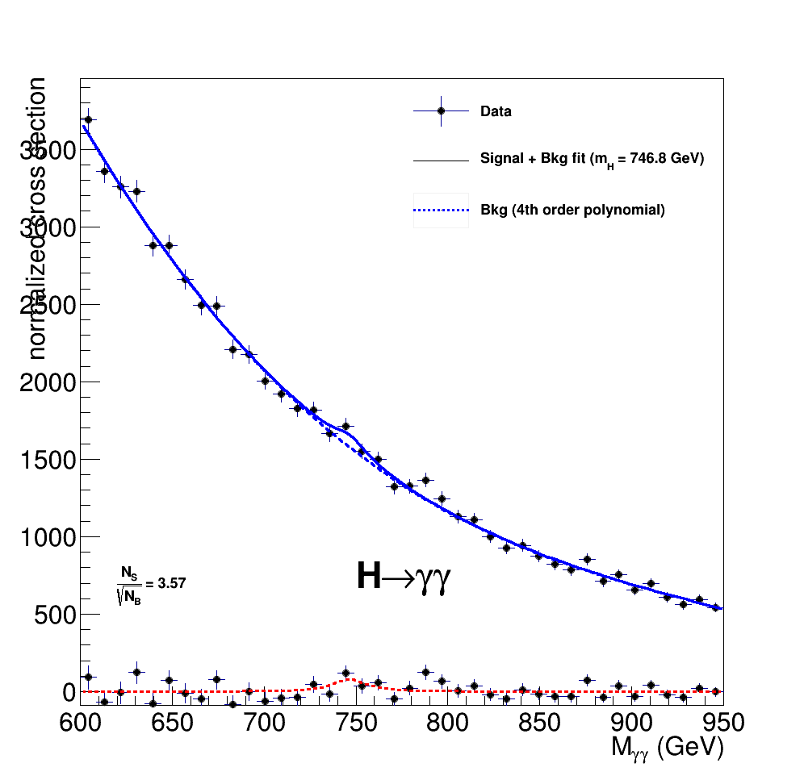

# FatHiggs
Home exam for Computing Methods for High Energy Physics at Helsinki University




## Datasets generation (1)

After suffering a lot to discover how to use CMSSW, I gave up and started again
with plain Pythi8 and ROOT.

To be possible to save Pythia8 events in a root file, i had to make the
constructor of the class ResonanceWidhts (pythia8125/include/Pythia8/ResonanceWidths.h)
public. I got compilation errors when it was protected.

The Makefile downloads Pythia8 and apply the patch to make it work with root.
It also creates two binaries: signal and background. Each one produces a root file.

Smearing of the momenta is done only for photons, before the trigger.

The events are only saved if there are at least two photons with pseudorapidity < 2.5
and transverse momenta > 60 GeV/c.

The number of events that passed the trigger, trigger efficiency and the total cross
section (in mb) are saved in a ntuple "info" in the same root file as the tree with
the pythia events.


### Signal generation

To generate the signal, I am using the following Pythia settings:

* HiggsSM:all = on
* 25:m0 = 750
* 25:doForceWidth = on
* 25:mWidth = 45
* 25:onMode = off
* 25:onIfMatch = 22 22

### Background generation

To generate the background, I am using the following Pythia settings:

* PromptPhoton:ffbar2gammagamma = on
* PromptPhoton:gg2gammagamma = on
* PhaseSpace:mHatMin = 500
* PhaseSpace:mHatMax = 1000


## Data analysis (2)

The analysis code for the signal selects events with exactly two final photons
with transverse momenta greater than 150 GeV and 200 GeV. The 4-momenta of
these photons are summed and the invariant mass is from this sum.

For the background, there is no selection. The two photons with the highest
transverse momentum in each event are used.

This code produces another root file with the invariant mass from the signal,
invariant mass from the background, and two NTuples, each with the total
number of events in the simulation, the events that passed the trigger,
trigger efficiency, total cross section and the number of selected events.


## Histogram (3)

The plot is made with the sum of the signal and the background. After this
histogram is made, I fit a function BreitWigner + 4th order polynomial. From
the parameters of the fit, I extract the signal. The solid blue line is the
fit of background + signal. The dashed blue line is the polynomial only.
The dashed red line is the Breit Wigner with the parameters given by the fit.
The signal *data* is calculated as the histogram points subtracted the
polynomial fit.

The signal and background have different normalizations. The cross section for
the signal is set to 6.2 fb. For the background, I use the value from Pythia.


## Compiling and Running

This code needs a recent compiler that supports C++11 and
[ROOT 6](https://root.cern.ch/).

To compile the code, use the Makefile in each folder:

* for datasetes generation (it will take a long time to run):

```
    cd 1/
    make
    ./signal
    ./background
```

* for data anaylsis:

```
    cd 2/
    make
    ./myHiggs
```

* for the histogram:

```
    cd 3/
    make
```


## Results

* Trigger Efficiency

  The trigger efficiency for the signal is 92% and for the background is 36%.

* Selection of events

  Of the signal events that passed the trigger, 84% passed the selection.

  There was no selection for background.

* Mass and significance

  The mean of the Breit Wigner fit is 746.8 GeV with a significance of 3.57


## Comments

We can also see some other peaks in the histogram and depending on the fit
options, I get different mean value for the Breit Wigner distribution. This
can be improved with more events in the analysis.

With a statistical significance of only 3.57, I can't convince myself of a
discovery.

To make this result more realistic, it would be interesting to simulate also
the detector systems, instead of adding a Gausian smearing to the photon's
momenta.

The simulated background consists of only f fbar and g g decaying to two
photons. It would be more realistic to also consider other channels.


## Questions

* 25:onIfAny or 24:onIfMatch or 25:onIfOnly?
* Why pythia is saving 2 trees in the root files?
* Normalization uses the number of events that passed the trigger?
* status == 1 produces no photons. (?)
* Why pythia reports higghs width = 239 ?
    - Why pythia needs doForceWidth = on when I set the mWidth?


## TODO

### 1

- [x] check if higgs width is really changed in ex 1.a
- [x] set crosssection in ex 1
    * there is no need for this
- [x] smear momenta
    - [x] check for const references in event[i]
- [x] add trigger
- [x] limit phase space
- [x] write dataset root file
- [x] make pythia print the cross section somewhere (in root file?)
- [x] save trigger efficiency somewhere (in root file?)


### 2

- [x] get number of events passing selection
    - [x] save it somewhere


### 3

- [x] normalization
- [x] fit
- [x] add pretty texts


### 4

- [ ] write readme explaining everything
    - [x] explain structure of code
    - [x] explain how to run
    - [ ] explain/comment results
        - [x] trigger efficiency
        - [x] events passing selection
        - [ ] calculate number of events for luminosity of 100 / fb
        - [x] estimate statistical significance
        - [x] can we trust this results?
    - [x] general comments


### general

- [x] get rid of useless output
- [x] check photon.status == 1 somewhere
- [x] make patch for pythia to work properly
- [z] check if units from pythia8 and root are the same:
    - [z] 2: TLorentzVector(pythia::particle.4momentum)
    - [x] 3: in the crosssections
